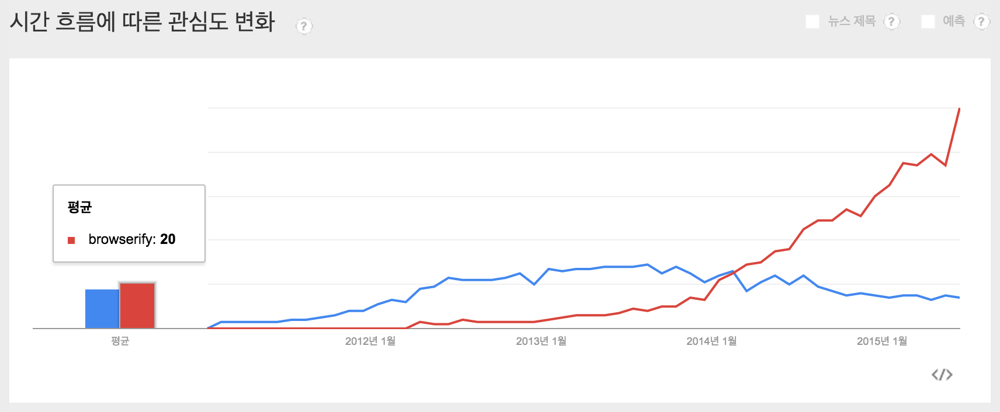

[＜ README.md](../README.md)

-

### 2일차 "JS 모듈 관리(Javascript Modules Management)"

이번 시간에는 Javascript 관리와 성능을 향상시키지 위한 모듈 관리방법에 대해 알아보고 
Client/Server Side Javascript 표준화를 위한 [CommonJS](http://en.wikipedia.org/wiki/CommonJS), [AMD](http://en.wikipedia.org/wiki/Asynchronous_module_definition)에 대해 공부합니다. 
익히 잘 알려진 모듈 관리도구로는 `Require.js`와 `Browserify`가 있습니다.

- [＞ Require.js](module-loader/requirejs.md)
- [＞ Browserify](module-loader/browserify.md)

-

### 모듈 관리도구 - 현재 트랜드 체크!

[Google 트렌드 자료](http://www.google.com/trends/explore#q=require.js%2C%20Browserify&date=1%2F2011%2054m&cmpt=q&tz=)를 살펴보면 2014년 이후부터 `Require.js` 보다 `Browserify` 검색량이 급증.

-

### 프론드-엔드 개발자로서 요구되는 능력

#### 고려해야 할 목표
- 접근성
- 사용성
- 성능 향상

#### 요구되는 테크닉

- **가이드라인**
	- 접근성
	- 검색엔진최적화(SEO)
	- UX 사용성 모델

- **웹 언어**
	- HTML
	- CSS
	- Javascript

- **라이브러리**
	- jQuery
	- Underscore
	- Modernizr

- **이미지 편집**
	- Photoshop
	- Illustrator

- **프리프로세싱 & 컴파일러**
	- CSS
		- Sass
		- LESS
	- JS
		- CoffeeScript
		- TypeScript

- **모듈 관리**
	- requireJS
	- Browerify

- **업무 관리도구**
	- Gulp
	- Grunt

- **클라이언트 사이드 MVC 프레임워크**
	- Angular
	- Backbone